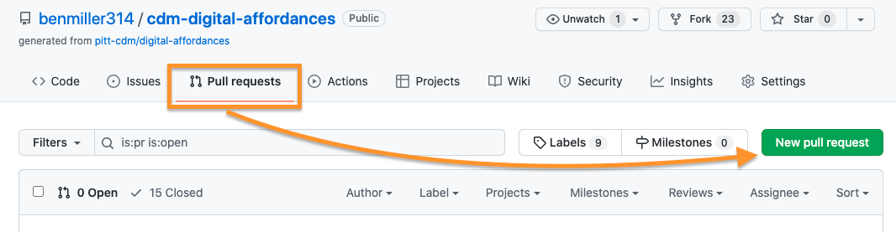

# Practice forking an assignment repository and editing its files

## A few terms of art
A **repository**, often abbreviated to **repo**, is just a fancy way of saying _folder_. It's a bunch of files. It can have subfolders inside it. You're looking at a repository right now! (See the files up above this text?)

This text is, itself, coming from a single file inside the repository, with the special name of **README.md**. Anything appearing in the README will show up here. The file extension, '.md', refers to _Markdown_, a simple syntax for signaling display formats (bold, italic, bullets, headings, etc) in plain text files. As you can see here, GitHub knows how to render markup like `**repo**` in bold and `_folder_` in italics. Follow the link in this sentence for an [overview of Markdown syntax](https://www.markdownguide.org/basic-syntax/) you can use.

To **fork** a repo is to _make a copy_ of it: all the files, and – importantly – the complete \*history\* of those files. This lets you safely play with and edit the files, without worrying that you'll overwrite someone else's work. For today, I've asked you to work in teams; for the major projects coming up, you'll each have an individual set of files.

## Your task: write a very short story about what makes *digital* different
For this particular assignment, I'm asking you to work in groups to brainstorm about this phrase from the course title: "digital media." What do those words mean? Rather than try to reason abstractly about it, let's get creative and **start with a story**: a narrative about how going digital changed (or changes) things.

And, to help you practice working with git and GitHub, I'm going to ask you to collaborate by adding one sentence at a time, with a separate *commit* for each addition.

Please read through all the instructions before you start, so you know where you're headed.

### I. Make a copy you can all edit
1. To start, the team anchor should **Fork this repository,** using the button at the top right. 
2. Once you have your own copy, go into your Settings...  
3. ... and **add your groupmates as collaborators**. (You'll need to ask for their usernames or email addresses.)
4. Everyone else will need to check their email and accept the invitation.

### II. Do the work
1. **Create a new file**, with a name you think will be unique to your group. Use the following  conventions, which will help you later:
   - Use all lowercase letters in the filename.
   - Replace any spaces with underscores or hyphens.
   - End the filename with **.md** – an extension that tells GitHub and Atom you're using ["markdown" syntax](https://guides.github.com/features/mastering-markdown/), such as the pound symbol (#) to mark headings and asterisks.
   - End the file's contents with at least one blank line. This helps git's difference engine find seams between paragraphs, which would allow each member of the group to later edit simultaneously, without conflicting with each other when you merge.
   - **Use a meaningful commit message**, i.e. don't accept the default "create new file": instead, say *what* is new in this version, e.g. "add starter file with blank lines".
2. In that file, you're going to write a story, one line at a time. **Begin your story like this:** "At first, there was only analog:"
   - How would you continue the sentence after the colon? The first person to propose an answer should write it up.
   - When that person is done, **save and commit.** Use a meaningful commit message, i.e. don't accept the default message, like "update files": instead, say *how* you've updated it, e.g. "add bit about live performances".
   - If you're editing locally, push your changes.
3. **Take turns** adding to the file, so that **everyone in the group gets to make at least one commit.**
   - Each time, start by pulling changes (or refreshing the page, if you're working directly in GitHub).
   - Each time, use meaningful commit messages, rather than accept the default message (which doesn't tell us very much!)
   - Each time, end by pushing your changes... or by filing a _pull request_ to your own repository and merging it (see below).

### III. Share it back
Working in your own repository, or if you're working with peers but you're patient enough to go one at a time, you can commit straight to the main branch without deleting other contributions. But if you ever wanted to edit at the same time and _merge_, using **pull requests** instead adds an extra step for safety: a review process to ensure you're always adding to the most recent version, even if it's changed since you started your edit.

When you're working in a fork, you can also file a pull request back to the original repository. In that case, you can't push directly unless you have admin privileges there – but the repo owner can review what you've sent, and then decide if they want to pull what you're offering. Thus the name! (You're  *requesting* a pull.)

When your group is done with your story (or if you're just out of time), please file a pull request back to the assignment repo, as follows:

1. Either click "contribute" on the home screen of your forked repo, or go to the "Pull Requests" tab of either repo and click on the "New pull request" button: 
2. Verify that the arrow is pointing from your repo (the "head") back to the original (the "base")... 
3. Write a short description of what you're sending over -- and notice that a single pull request can contain multiple commits, if you want.

That's it for sharing "upstream"!

To see what it would look like to pull request within your own project, click here.

<h3>GH Pull requests as / instead of commits</h3>
The merge and review process just takes you through a series of prompts and buttons; in the middle, you can write back and forth just as you can on the issue queue. Here's how it would look:

<figure>
<figcaption><ol><li>Top left. Instead of committing directly, you have the option to create a new branch and start a pull request.</li><li>Top right. Confirm the branches and direction of the proposed pull, and write a note to your partners about what you're proposing.</li><li>Middle left. GitHub will attempt to find conflicts.</li><li>Middle right. If there are none, your job is simple! Just decide whether to merge. (If there are, I recommend Atom as a tool to resolve them.)</li><li>Bottom left. The merge becomes a new commit in the destination repository, so you get to write a new commit message. Make it meaningful!</li><li>After the merge, you will be prompted to delete the source branch, since its contents are now integrated.</li></ul>
</figure>

EXT: All done with the main activity? Read the file in this repo (folder) called `murray--four-affordances.md`, and follow the prompts inside it.

